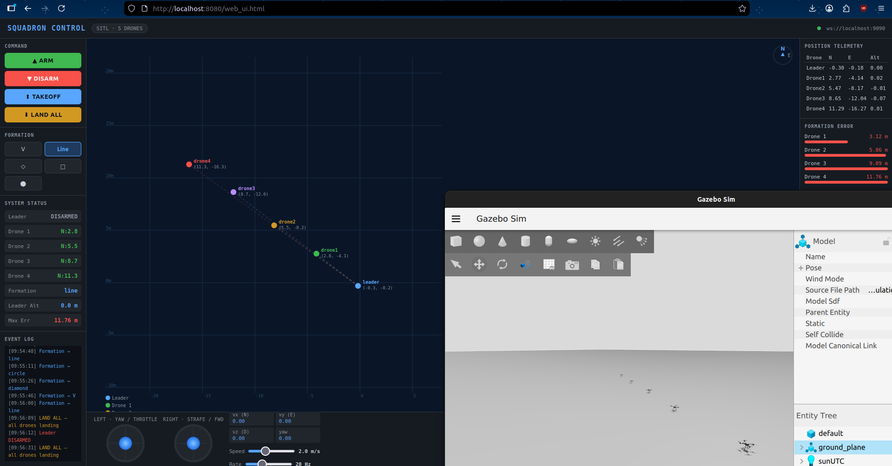
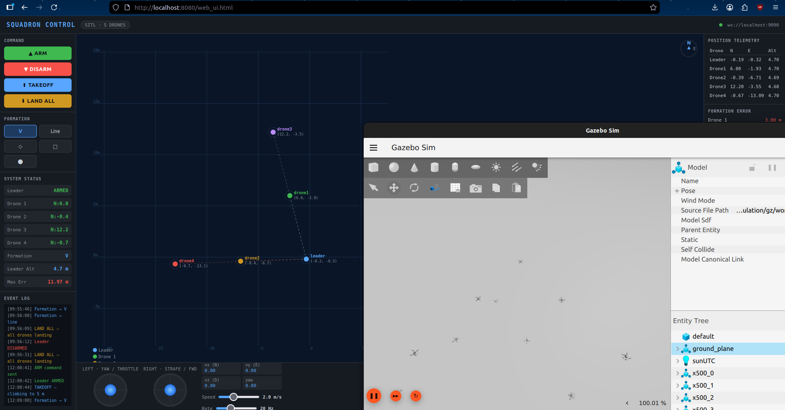
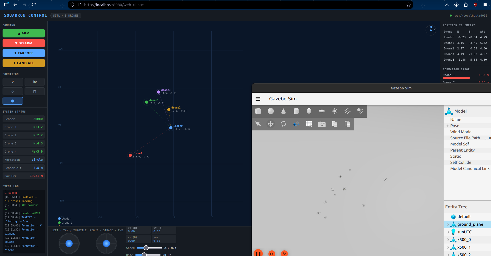
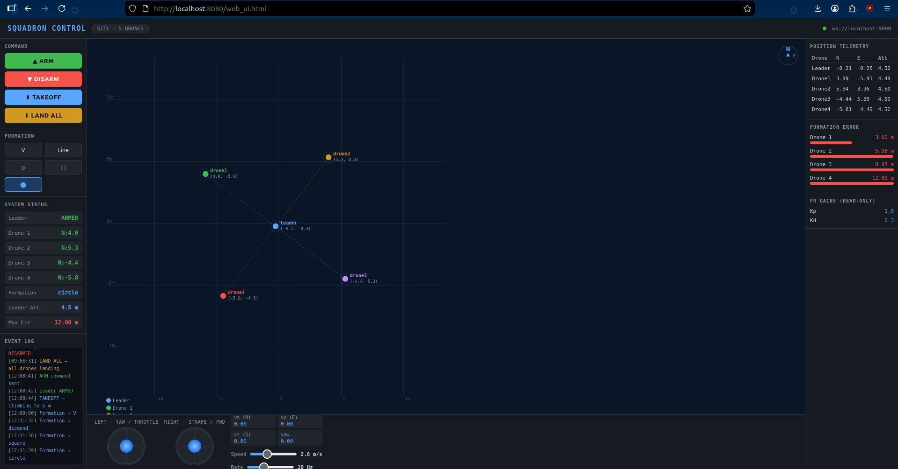

# UI-Controlled Squadron Using ROS 2

A browser-based hierarchical control system for multi-UAV squadrons simulated in Gazebo. A human operator pilots a **leader drone** via a virtual joystick in the web UI, and up to N **follower drones** autonomously maintain configurable formations with real-time collision avoidance.

<!-- 📸 SUGGESTED IMAGE: Full system screenshot — Gazebo window + Web UI side by side showing drones in V formation -->


---

## Features

- **Web-based control** — virtual joystick, one-click arm/takeoff/land, no ROS installation needed in browser
- **5 formation types** switchable mid-flight: V, Line, Diamond, Square, Circle
- **Scalable** — supports any number of followers via a single environment variable (`NUM_FOLLOWERS`)
- **Collision avoidance** during formation transitions using Artificial Potential Fields (APF) + proximity speed capping
- **Live 2D map** showing all drone positions in world-frame NED coordinates
- **Auto arm/land** — followers arm with the leader and land when the leader disarms
- **Formation rotation** — formations track leader yaw, staying aligned as the leader turns

---

## Demo

<!-- 📸 SUGGESTED IMAGE: GIF or screenshot of drones flying in V formation in Gazebo -->


<!-- 📸 SUGGESTED IMAGE: GIF or screenshot of formation transition (e.g. V → Circle) showing drones navigating around each other -->


<!-- 📸 SUGGESTED IMAGE: Screenshot of the Web UI showing the virtual joystick, formation buttons, and live 2D map -->


---

## System Architecture

```
┌─────────────────────────────────────────────────────────┐
│                    Browser (Web UI)                      │
│  Virtual Joystick │ ARM/LAND buttons │ Formation Picker  │
│                   Live 2D Drone Map                      │
└──────────────────────┬──────────────────────────────────┘
                       │ WebSocket (port 9090)
                       │ rosbridge_websocket
┌──────────────────────▼──────────────────────────────────┐
│                   ROS 2 Nodes                            │
│                                                          │
│  leader_offboard ──► formation_manager ──► follower_1   │
│       │                    │           ──► follower_2   │
│  leader_teleop             │           ──► follower_N   │
│                   /fleet_world_positions (APF)           │
└──────────────────────┬──────────────────────────────────┘
                       │ uXRCE-DDS (port 8888)
┌──────────────────────▼──────────────────────────────────┐
│              PX4 SITL + Gazebo Harmonic                  │
│   Leader (instance 0) + N Followers (instances 1..N)     │
└─────────────────────────────────────────────────────────┘
```

<!-- 📸 SUGGESTED IMAGE: ROS 2 node graph (run `ros2 run rqt_graph rqt_graph` and screenshot) showing topics connecting all nodes -->

### ROS 2 Nodes

| Node | File | Role |
|---|---|---|
| `leader_offboard` | `leader_offboard.py` | Translates web UI commands to PX4 offboard velocity setpoints |
| `leader_teleop` | `leader_teleop.py` | Physical joystick → velocity commands |
| `formation_manager` | `formation_manager.py` | Computes per-follower targets at 20 Hz; broadcasts fleet positions for collision avoidance |
| `follower_controller` | `follower_controller.py` | Velocity PD controller + APF collision avoidance per follower |
| `state_monitor` | `state_monitor.py` | Fleet health telemetry (terminal) |

### Key ROS 2 Topics

| Topic | Type | Description |
|---|---|---|
| `/offboard_velocity_cmd` | `Twist` | Leader velocity from web UI / joystick |
| `/formation_type` | `String` | Formation change command |
| `/num_followers` | `Int32` | Published by manager every 3s; web UI auto-configures |
| `/droneX/target_position` | `PoseStamped` | Per-follower target in follower's NED frame |
| `/fleet_world_positions` | `Float32MultiArray` | All drone world-NED positions for APF collision avoidance |

---

## Formations

<!-- 📸 SUGGESTED IMAGE: 2x3 grid showing all 5 formations on the 2D map (V, Line, Diamond, Square, Circle) — can be screenshots from the web UI -->

| Formation | Description |
|---|---|
| **V** | Classic V-shape trailing behind leader |
| **Line** | Single file behind leader |
| **Diamond** | Diamond pattern around leader |
| **Square** | Square grid behind leader |
| **Circle** | Ring of drones orbiting behind leader (dynamic, radius 7 m) |

All formations are defined in the **leader body frame** and automatically rotate with leader yaw.

---

## Collision Avoidance

During formation transitions, drones use **Artificial Potential Field (APF)** repulsion to avoid collisions:

1. `formation_manager` broadcasts world-frame positions of all drones on `/fleet_world_positions`
2. Each follower computes a repulsion velocity from drones within `D_SAFE = 6.0 m`
3. **Proximity speed cap**: `max_speed = 4.0 × (distance / D_SAFE)` — drones slow down as they approach each other, allowing repulsion to overpower the formation attraction

<!-- 📸 SUGGESTED IMAGE: Side-by-side Gazebo screenshot of a formation transition showing drones navigating safely around each other -->

---

## Prerequisites

| Dependency | Version |
|---|---|
| Ubuntu | 22.04 |
| ROS 2 | Humble |
| PX4-Autopilot | v1.17.0-alpha1 |
| Gazebo | Harmonic (gz sim 8.x) |
| MicroXRCEAgent | Latest |
| Python | 3.10+ |

> **Important:** Use `px4_msgs` at commit `51e6678` exactly. The latest version has a message payload mismatch that silently breaks all status callbacks.

---

## Installation

### 1. Clone the workspace
```bash
git clone https://github.com/ChaitanyaSaiNikith/UI-Controlled-Squadrone-Using-ROS2.git ~/squadron_ros2_ws
cd ~/squadron_ros2_ws
```

### 2. Copy the correct px4_msgs
```bash
# Assumes you have PX4-Autopilot and a ros2 workspace with the pinned px4_msgs
cp -r ~/px4_ros2_ws/src/px4_msgs ~/squadron_ros2_ws/src/px4_msgs
```

### 3. Build
```bash
cd ~/squadron_ros2_ws
source /opt/ros/humble/setup.bash
colcon build
```

---

## Usage

### Terminal 1 — Start PX4 SITL + Gazebo + DDS agent

```bash
cd ~/squadron_ros2_ws
./scripts/launch_multi_sitl.sh 4    # replace 4 with desired number of followers
```

Wait until you see **"All drones ready!"** before proceeding.

### Terminal 2 — Launch ROS 2 nodes

```bash
cd ~/squadron_ros2_ws
colcon build --packages-select multi_uav_control && source install/setup.bash
export NUM_FOLLOWERS=4 SPAWN_NORTH_M=3.0
ros2 launch multi_uav_control formation_control.launch.py
```

### Terminal 3 — Start the web server

```bash
cd ~/squadron_ros2_ws/web && python3 web_server.py
```

### Browser — Open the control UI

Navigate to **[http://localhost:8080/web_ui.html](http://localhost:8080/web_ui.html)**

<!-- 📸 SUGGESTED IMAGE: Screenshot of web UI at startup showing green connection dot and all drone indicators -->

**Operating sequence:**
1. Wait for the green connection dot in the top bar
2. Press **TAKEOFF** — leader climbs to 5 m, followers auto-arm and join formation
3. Use the **right joystick** to fly the leader (forward/strafe)
4. Use the **left joystick** for throttle and yaw
5. Click formation buttons (**V / Line / ◇ / □ / ⬤**) to switch mid-flight
6. Press **LAND ALL** to land the entire squadron

### Optional — QGroundControl (monitoring)

```bash
~/QGroundControl-x86_64.AppImage
```

---

## Configuration

| Environment Variable | Default | Description |
|---|---|---|
| `NUM_FOLLOWERS` | `2` | Number of follower drones |
| `SPAWN_NORTH_M` | `3.0` | Gazebo spawn spacing between drones (metres) |

Collision avoidance constants in [follower_controller.py](src/multi_uav_control/multi_uav_control/follower_controller.py):

| Constant | Default | Description |
|---|---|---|
| `D_SAFE` | `6.0 m` | Safety radius — repulsion activates inside this distance |
| `K_REP` | `8.0` | Repulsion gain strength |
| `D_MIN` | `0.3 m` | Minimum distance clamp (prevents singularity) |

---

## Project Structure

```
squadron_ros2_ws/
├── web/
│   ├── web_ui.html              # Browser control interface
│   └── web_server.py            # Local HTTP server (port 8080)
├── scripts/
│   ├── launch_multi_sitl.sh     # Launches PX4 SITL + Gazebo + DDS agent
│   └── switch_formation.sh      # CLI formation switcher
└── src/
    ├── px4_msgs/                # PX4 ROS 2 message definitions (commit 51e6678)
    └── multi_uav_control/
        ├── multi_uav_control/
        │   ├── leader_offboard.py
        │   ├── leader_teleop.py
        │   ├── formation_manager.py
        │   ├── follower_controller.py
        │   └── state_monitor.py
        ├── launch/
        │   └── formation_control.launch.py
        ├── package.xml
        └── setup.py
```

---

## How It Works

### Leader-Follower Control

The leader drone is controlled directly via web UI velocity commands. Formation manager reads the leader's world-NED position and yaw at 20 Hz, rotates the formation offsets (defined in leader body frame) into world NED, subtracts each follower's spawn offset to convert into the follower's local NED frame, then publishes individual targets.

Each follower runs a **velocity PD controller**:
```
v_cmd = Kp × (target − position) − Kd × current_velocity
```
with `Kp = 0.5`, `Kd = 0.3`, `max_horizontal = 4 m/s`.

### Multi-Instance NED Frames

Each PX4 SITL instance has its NED origin at its Gazebo spawn point. Follower `i` spawns at `y = i × 3 m` (Gazebo Y = NED North), so its local NED x is offset from world NED by `3 × i` metres. Formation manager handles this conversion automatically.

---

## Troubleshooting

| Problem | Fix |
|---|---|
| Web UI shows "unable to connect" | Wait 2s — it auto-retries. Ensure rosbridge is running (Terminal 2) |
| Followers don't arm | Ensure leader is armed first and above 3 m altitude |
| Drones scatter on formation change | Check `D_SAFE` and `K_REP` in `follower_controller.py` |
| `RTPS_READER_HISTORY payload size` errors | Wrong `px4_msgs` version — pin to commit `51e6678` |
| 2D map positions look wrong | Ensure `SPAWN_NORTH_M` matches the value used in `launch_multi_sitl.sh` |

---

## Tech Stack

- **ROS 2 Humble** — middleware and node framework
- **PX4 SITL** — flight controller simulation
- **Gazebo Harmonic** — 3D physics simulation
- **MicroXRCE-DDS** — PX4 ↔ ROS 2 bridge
- **rosbridge_websocket** — ROS 2 ↔ browser bridge
- **Python 3** — all ROS 2 nodes
- **Vanilla HTML/JS** — web UI (no framework dependencies)
